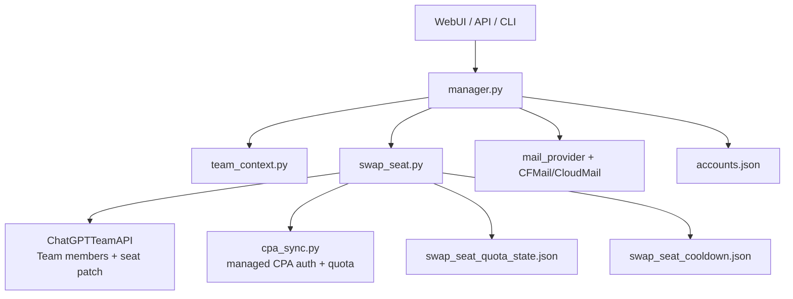

# Agent 接手指南

这份文档给下一个接手 AutoTeam 的 agent 使用。目标是用最短时间看懂项目边界、主流程、模块职责、数据文件和当前容易踩坑的位置。

## 先读结论

AutoTeam 当前主线不是通用账号池轮转器，而是 `swap_seat-only` 的 Team seat / CPA OAuth 调度控制台。

它的设计目标是：

- 从 Team runtime 读取成员和 pending invite。
- 从 CPA 读取 OAuth/auth-files 和 quota。
- 根据 quota 选择可用成员保持 ChatGPT seat 与 CPA OAuth active。
- 其他受管成员保持 Codex seat 与 CPA OAuth disabled standby。
- 用本地 quota cache 与 cooldown 降低重复检查和无效切换。
- 多 Team 通过 `TEAM_WORKSPACES_JSON` 隔离 account_id、cooldown、quota cache。
- WebUI 和 CLI 都走同一批 manager/swap_seat 函数。

接手时最重要的约束：

- 不要打印 `.env`、`state.json`、`accounts.json`、HAR、session、PAT、CPA key、邮箱密码。
- 不要随意改真实 CPA auth；代码设计上只能操作 AutoTeam 自己登记/创建的 managed auth。
- 不要 kick/remove Team member，不要 cancel pending invite。
- 不要把“旧账号池兼容接口”当主流程；主流程在 `swap_seat.py`、`manager.py`、`api.py`。
- 做真实副作用前先读 `git status --short`，当前仓库长期处于 dirty worktree，不能 revert 不属于你的改动。

## 项目功能地图

| 功能域 | 主要入口 | 说明 |
|---|---|---|
| WebUI / HTTP API | `src/autoteam/api.py`, `web/src/*` | FastAPI 提供配置、任务、状态、日志接口；Vue 负责控制台页面 |
| CLI | `src/autoteam/manager.py` | `autoteam` 命令入口；多数业务动作最终由这里调度 |
| Seat 调度 | `src/autoteam/swap_seat.py` | 根据 CPA quota 生成并执行 seat/OAuth 收敛 plan |
| Team API | `src/autoteam/chatgpt_api.py`, `src/autoteam/chatgpt_transport.py` | 管理员 session 后的 Team API 调用；写操作有安全闸 |
| CPA 集成 | `src/autoteam/cpa_sync.py` | list/upload/delete/check quota/set disabled；受 managed registry 保护 |
| 邮箱服务 | `src/autoteam/mail_provider.py`, `cloudflare_temp_email.py`, `cloudmail.py` | 解析邮箱服务配置、创建/读取临时邮箱、轮询验证码/邀请邮件 |
| 浏览器后端 | `src/autoteam/browser_backend.py` | 封装 CloakBrowser/Playwright session capture backend |
| 注册/邀请兼容路径 | `src/autoteam/invite.py`, `src/autoteam/manager.py` | 处理 pending invite 注册等旧流程；不是默认 swap 的第一入口 |
| PAT / OAuth 文件 | `src/autoteam/codex_pat_export.py`, `src/autoteam/codex_auth.py`, `auth_storage.py` | 生成/保存 CPA auth JSON 的支持代码 |
| 本地状态 | `accounts.py`, `admin_state.py`, `team_context.py` | 管理本地账号记录、管理员 session、多 Team 上下文 |
| 归档同步 | `sub2api_sync.py`, `sync_targets.py` | Sub2API/旧同步兼容，非当前主路径 |

## 主流程

一次单 Team 调度大致是：

1. `api.py` 或 CLI 调用 `manager.cmd_swap_seats()`。
2. `manager.py` 准备 `ChatGPTTeamAPI` 和可选 `TeamContext`。
3. `swap_seat.cmd_swap_seats()` 读取 Team members 与 CPA auth-files。
4. 按邮箱匹配 Team member 和 CPA Codex OAuth。
5. 过滤主号、白名单、非 AutoTeam managed member/auth。
6. 对候选 auth 检查或复用 quota cache。
7. 任一 quota window 耗尽则视为不可用；当前代码已包含 `primary`、`weekly`、`monthly` 三个窗口字段。
8. 选择最多 `max_chatgpt_active` 个可用成员。
9. 若 plan 有副作用且 cooldown 允许，先降级未选中成员，再升级选中成员。
10. CPA 侧先 disable 未选中 auth，再 enable 选中 managed auth。
11. 如果可用 GPT seat 低于目标，调用方可以选择消费 pending invite 或走受控 create invite 模式补位。



## 安全边界

`chatgpt_api.py` 对 Team API 写操作做了硬限制：

- 禁止删除 Team user。
- 禁止删除/cancel invite。
- 默认禁止创建 invite；只有受控入口临时打开 `allow_team_invites`。
- 禁止 patch invite。
- 只允许修改 user 的 `seat_type`。

`cpa_sync.py` 对 CPA auth 做 managed 限制：

- `managed_cpa_auths.json` 是 AutoTeam 自己上传/登记的 auth registry。
- `get_managed_cpa_auth_names()` 只返回 registry、本地 AutoTeam 账号、显式允许的手动 managed name。
- 环境变量 `CPA_MANAGED_AUTH_NAMES` 默认会被忽略，除非同时设置 `CPA_ALLOW_MANUAL_MANAGED_AUTH_NAMES=true`。
- 接手时不要直接对 CPA 全量 auth 做 enable/delete；必须经过 managed 判定。

`swap_seat.py` 对成员做 managed/whitelist 限制：

- `SWAP_SEAT_WHITELIST_EMAILS` 中的成员不查 quota、不切 seat、不启停 CPA OAuth。
- `get_autoteam_managed_member_emails()` 只认可 `managed_by_autoteam`、`created_by=autoteam` 或有 mail account id 的本地账号。
- 外部成员、主号、未明确受管成员不应被主动 seat-swap。

## 当前配置和状态文件

| 文件 | 是否含敏感信息 | 作用 |
|---|---:|---|
| `.env` | 是 | 运行配置、CPA、邮箱服务、API key、巡检策略 |
| `.env.example` | 否 | 配置模板 |
| `state.json` | 是 | 管理员 session、workspace/account_id 等 |
| `accounts.json` | 是 | 本地账号池兼容记录、member session/auth 状态 |
| `managed_cpa_auths.json` | 可能 | AutoTeam 已登记的 CPA auth name registry |
| `swap_seat_quota_state.json` | 否/低敏 | quota cache，按 `account_id + auth_id` 隔离 |
| `swap_seat_cooldown.json` | 否/低敏 | 每个 Team 的 swap cooldown |
| `chatgpt*.har` | 是 | 抓包分析材料，可能包含 header/cookie/token，不能输出 |
| `src/autoteam/web/dist/*` | 否 | Vue build 产物，编辑前端后需要重建 |

## Python 模块说明

| 模块 | 职责 | 接手提示 |
|---|---|---|
| `__main__.py` | 支持 `python -m autoteam` | 只是转发 CLI |
| `manager.py` | 业务编排中心，CLI 命令入口 | 文件很大；优先定位 `cmd_swap_seats`、`cmd_auto_detect_replace`、`cmd_manage_teams`、`cmd_add`、`cmd_invite_add` |
| `api.py` | FastAPI 服务、WebUI 静态资源、后台任务、自动巡检 | 修改配置项时通常要同步 Pydantic model、runtime env key、WebUI 表单和测试 |
| `swap_seat.py` | seat/OAuth 收敛算法、quota cache、cooldown、白名单 | 当前最核心模块；任何 seat/CPA 行为变更先从这里建模和测试 |
| `chatgpt_api.py` | Team API 客户端、管理员 session、workspace 选择、安全闸 | API 写操作的禁止规则在 `_guard_team_api_write` 附近 |
| `chatgpt_transport.py` | 基于 `curl_cffi` 的 ChatGPT HTTP transport | 已持有 session 后优先 API-only 调用 |
| `team_context.py` | 解析 `TEAM_WORKSPACES_JSON`，生成 `TeamContext` | 多 Team 的 account_id/cooldown scope/quota scope 都依赖它 |
| `admin_state.py` | 读写管理员登录态 | 不要在文档或日志里输出 session token |
| `accounts.py` | 读写 `accounts.json`，维护本地账号兼容状态 | 不是 quota 真相源，只是受管账号和注册状态辅助 |
| `account_ops.py` | Team members/invites/state 的读取和旧清理辅助 | 读取函数仍常用；删除/清理类函数要谨慎 |
| `cpa_sync.py` | CPA auth-files、quota、上传、启停、managed registry | 任何 CPA 副作用必须尊重 managed auth registry |
| `codex_pat_export.py` | 用 ChatGPT session 创建 token 并生成 CPA auth JSON | 含 session/PAT 敏感逻辑，测试时优先 mock |
| `codex_auth.py` | OAuth 登录、token refresh、quota payload 解析 | 历史包袱较多；quota parser 和 session flow 仍被测试覆盖 |
| `auth_storage.py` | auth 目录与权限辅助 | 小模块，通常不需要改 |
| `browser_backend.py` | CloakBrowser/Playwright backend 统一适配 | 当前默认 backend 是 `cloakbrowser`；关闭浏览器不等于登出账号 |
| `invite.py` | 注册页面自动化、验证码/按钮处理、错误分类 | 已修过 Google sign-in 误点问题；相关测试在 signup/invite 类用例 |
| `mail_provider.py` | 邮箱服务配置规范化、服务选择、客户端工厂 | 多邮箱服务和 legacy env 都从这里统一 |
| `cloudflare_temp_email.py` | Cloudflare Temp Email 管理端 API 客户端 | 当前 `CF_TEMP_EMAIL_DOMAIN` 多域名是随机选择，不是 round-robin |
| `cloudmail.py` | CloudMail 兼容客户端 | 保留兼容，主推荐路径是 Cloudflare Temp Email |
| `manual_account.py` | 手动 OAuth callback 捕获 | 辅助路径，不是自动巡检主线 |
| `playwright_probe.py` | 短生命周期 Playwright 探针 | API 中用于隔离某些浏览器探测 |
| `setup_wizard.py` | 首次启动/配置校验 | 新配置项若要 WebUI/首次配置可见，需要同步这里 |
| `signup_profile.py` | 注册资料生成 | 测试关注年龄/birthday 边界 |
| `sync_targets.py` | CPA/Sub2API 同步目标分发 | 归档兼容居多 |
| `sub2api_sync.py` | Sub2API 旧同步实现 | 非当前 swap_seat 主路径 |
| `config.py` | `.env` 和环境变量读取、默认值、normalize helper | 新 env key 要同时考虑 API runtime reload |
| `display.py` | Linux 下自动准备虚拟显示器 | import side effect 模块 |
| `textio.py` | 文本读写和 `.env` 行解析 | 写 `.env` 时避免破坏注释/转义 |

## WebUI 模块说明

| 文件 | 职责 |
|---|---|
| `web/src/App.vue` | 顶层路由状态、登录态、setup flow、任务轮询 |
| `web/src/api.js` | 前端 API client，统一带 API key 调用后端 |
| `web/src/components/Dashboard.vue` | 总览页，展示 Team、CPA、quota/cooldown 概览 |
| `web/src/components/TaskPanel.vue` | 触发 swap、auto-detect-replace、manage-teams、invite-add 等后台任务 |
| `web/src/components/TeamMembers.vue` | Team member/pending invite 列表和只允许的成员操作 |
| `web/src/components/PoolPage.vue` | CPA OAuth active/standby 和 quota cache 视图 |
| `web/src/components/ConfigPage.vue` | 运行配置、管理员 session、多 Team、邮箱服务、自动巡检配置 |
| `web/src/components/Settings.vue` | 自动巡检设置卡片 |
| `web/src/components/SetupPage.vue` | 首次配置向导 |
| `web/src/components/TaskHistory.vue` | 任务历史摘要 |
| `web/src/components/TaskHistoryPage.vue` | 任务历史页面壳 |
| `web/src/components/LogViewer.vue` | 后端内存日志查看 |
| `web/src/components/Sidebar.vue` | 左侧导航 |
| `web/src/components/ThemeToggle.vue`, `theme.js`, `style.css` | 主题和视觉样式 |

前端修改后通常需要：

```bash
cd web
npm run build
```

构建产物会写入 `src/autoteam/web/dist/`，提交前注意 dist 是否符合预期。

## API/任务入口

| 入口 | 作用 | 备注 |
|---|---|---|
| `GET /api/teams` | 读取受管 Team 列表 | 不返回 session token |
| `GET /api/team/members` | 读取成员与 pending invite | 只读 |
| `GET /api/swap/runtime-status` | 读取 quota cache/cooldown | 只读 |
| `GET/PUT /api/config/runtime` | WebUI 配置项读写 | 会热加载 runtime env |
| `GET/PUT /api/config/source` | `.env` 源文本编辑 | 高风险，必须避免输出 secrets |
| `GET/PUT /api/config/auto-check` | 自动巡检配置 | 新巡检字段要同步这里 |
| `POST /api/tasks/swap-seats` | 单 Team seat/OAuth 收敛 | 主任务 |
| `POST /api/tasks/auto-detect-replace` | 单 Team swap 后按条件补位 | 是否补位由参数/config 决定 |
| `POST /api/tasks/manage-teams` | 多 Team 调度 | 逐 Team 调用 |
| `POST /api/tasks/add` | 消费已有 pending invite | 受前置检查保护 |
| `POST /api/tasks/invite-add` | 显式新增 invite 路径 | 只有显式入口允许 create invite |
| `PATCH /api/cpa/auth/status` | CPA auth 状态修改 | 手动只允许 disable；enable 由 swap 决策 |

旧账号池相关的 API 仍有代码和页面兼容，但不是主线。遇到 `/api/accounts/*`、`fill`、`cleanup`、`sync` 等路径时，先查测试确认当前期望是禁用、兼容展示，还是仍有残留行为。

## 配置项索引

核心配置在 `.env` / WebUI 配置页：

- `API_KEY`：WebUI/API 鉴权。
- `CPA_URL` / `CPA_KEY`：CPA 管理 API。
- `MAIL_PROVIDER`：默认 `cloudflare_temp_email`。
- `CF_TEMP_EMAIL_BASE_URL` / `CF_TEMP_EMAIL_ADMIN_PASSWORD` / `CF_TEMP_EMAIL_DOMAIN`：Cloudflare Temp Email。
- `MAIL_SERVICES_JSON` / `MAIL_SERVICE_DEFAULT`：多邮箱服务。
- `TEAM_WORKSPACES_JSON`：多 Team 配置。
- `SWAP_SEAT_WHITELIST_EMAILS`：不管理名单。
- `AUTO_CHECK_INTERVAL`：自动巡检间隔。
- `AUTO_CHECK_TARGET_SEATS`：目标 GPT/OAuth active 数，1 到 5。
- `AUTO_CHECK_REPLACE_WITH_PENDING_INVITE`：低于目标时是否补位。
- `AUTO_CHECK_REPLACE_MODE`：`pending_invite` 或 `create_invite`。
- `BROWSER_BACKEND`：默认 `cloakbrowser`。
- `CLOAKBROWSER_PROFILE_DIR` / `CLOAKBROWSER_PROFILE_SEED` / `CLOAKBROWSER_HUMANIZE`：浏览器后端配置。
- `SWAP_QUOTA_CHECK_MIN_INTERVAL_SECONDS`：近期可用 quota 的重复检查最短间隔；当前从 `swap_seat.py` 直接读环境变量。

新增配置项时要同步这些位置：

- `src/autoteam/config.py`
- `src/autoteam/api.py` 的 runtime config key、validation、reload globals、auto-check config model
- `src/autoteam/setup_wizard.py`
- `web/src/components/ConfigPage.vue`
- `web/src/components/Settings.vue`，如果属于巡检卡片
- `.env.example`
- `docs/configuration.md`
- 对应 unit tests

## 当前已知状态和待办

这部分是接手时尤其要留意的状态，避免基于旧上下文误判。

- `cloudflare_temp_email.py` 当前多域名选择是 `secrets.choice()` 随机选，不是 round-robin。
- 代码里目前没有 `CF_TEMP_EMAIL_DOMAIN_ROTATION` 配置项。
- 代码里目前没有 `SWAP_QUOTA_CHECK_STAGGER_SECONDS` 配置项。
- `swap_seat.py` 已支持 `monthly` quota 字段，并且 `quota_available()` 要求 primary/weekly/monthly 都大于 0。
- `config.py` 当前已新增 `AUTO_CHECK_REPLACE_MODE` 和 CloakBrowser backend getter。
- `.env.example` 当前写了 CloakBrowser 配置，但没有域名轮换配置。
- README/docs 中已经描述了 create invite/pending invite 能力，但真实生产操作前必须重新审查安全闸和 managed 范围。
- `src/autoteam/web/dist` 是构建产物，前端源文件变更后需要重新 build。
- `chatgpt.com.har`、`chatgpt2.com.har` 可能含敏感抓包信息，只能本地分析，不能复制到回复。

## 测试地图

| 测试文件 | 覆盖重点 |
|---|---|
| `test_swap_seat.py` | seat plan、quota cache、cooldown、monthly、白名单、managed guard |
| `test_cpa_sync.py` | CPA API、managed auth registry、auth 状态解析 |
| `test_chatgpt_transport.py` | HTTP transport/session cookie |
| `test_chatgpt_workspace.py` | workspace/account 选择 |
| `test_api_status.py` | Web/API 状态、配置读写、自动巡检配置 |
| `test_api_swap_only_disabled.py` | 旧危险入口禁用和 swap-only 行为 |
| `test_api_team_members.py` | 成员/pending invite API 展示和操作边界 |
| `test_manager_emergency_invite.py` | pending invite/create invite 补位路径 |
| `test_manager_auth_repair.py` | PAT/auth repair 状态机 |
| `test_manager_quota.py` | quota 判断与 manager 层行为 |
| `test_manager_fill.py`, `test_manager_rotate.py`, `test_manager_reinvite.py`, `test_manager_reset_quota.py` | 旧/兼容 manager 命令行为 |
| `test_cloudflare_temp_email.py`, `test_cloudmail.py`, `test_mail_provider.py` | 邮箱服务解析、API client、验证码提取 |
| `test_browser_backend.py` | CloakBrowser/Playwright backend 选择 |
| `test_codex_pat_export.py`, `test_codex_auth_session.py` | PAT/session/OAuth auth 文件逻辑 |
| `test_accounts.py`, `test_account_ops.py`, `test_admin_state.py`, `test_team_context.py` | 本地状态和 Team context |
| `test_setup_wizard.py`, `test_sync_targets.py`, `test_sub2api_sync.py` | 配置向导和归档同步 |

常用验证：

```bash
uv run ruff check src tests
uv run pytest -q
```

前端验证：

```bash
cd web
npm run build
```

安全回归扫描：

```bash
rg -n "removeTeamMember|delete_invite|cancel.*invite|kick_member|remove_member|DELETE.*users|PATCH.*/invites|POST.*invites|invite_member\\(" src/autoteam web/src tests/unit -S --glob "!src/autoteam/web/dist/**"
```

预期只应出现安全闸、禁用文案或测试断言；如果出现新的业务调用点，必须重新审查。

## 修改建议流程

1. 先跑 `git status --short`，确认已有 dirty files。
2. 只读理解相关模块和测试，不要直接改 `.env`、状态文件、HAR、auth。
3. 如果改调度逻辑，先补 `test_swap_seat.py`。
4. 如果改 API 配置，补 `test_api_status.py`，并同步 WebUI。
5. 如果改邮箱域名选择，补 `test_cloudflare_temp_email.py` 和 `test_mail_provider.py`。
6. 如果改 CPA 启停/删除，补 `test_cpa_sync.py`，并确认 managed guard。
7. 如果改浏览器后端，补 `test_browser_backend.py`，不要破坏 CloakBrowser 默认值。
8. 最后跑 ruff、pytest；前端改动再 build。

## 面向下一步需求的提醒

如果后续要实现“每轮 create invite 使用不同根域名”和“不要同时检查两个 seat”，建议拆成两个纯代码任务：

- CFMail 域名轮换：在 `cloudflare_temp_email.py` 加持久化 round-robin state，配置项放到 `config.py`/WebUI/`.env.example`，默认不破坏现有随机行为或通过显式配置启用。
- quota 检查错峰：在 `swap_seat.py` 的实时 CPA quota check 循环加入可配置 stagger，只对真实 live check 生效，cache 命中不 sleep。

这两个任务都可以先用 unit tests 和 dry-run/mocked CPA 验证，不需要触碰真实账号、真实 PAT 或真实 CPA auth。
