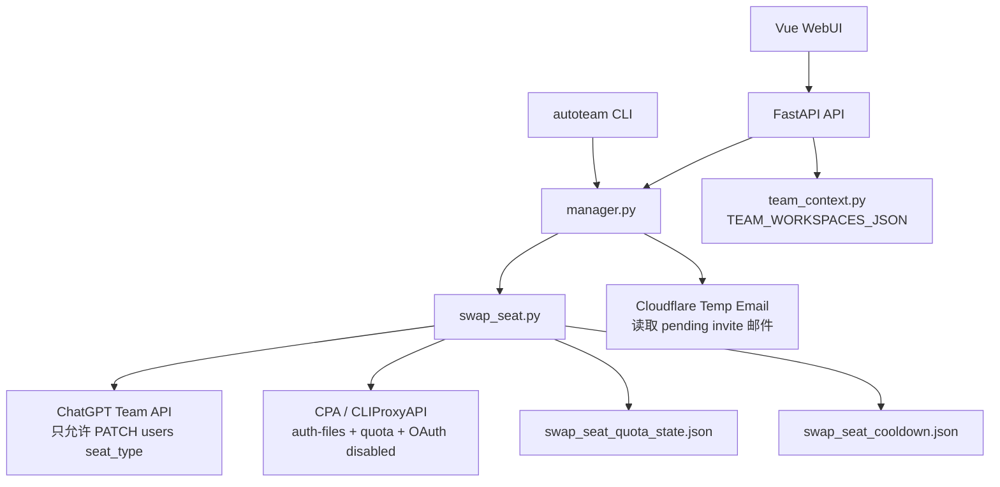

# 工作原理

AutoTeam 当前架构是 `swap_seat-only`。它不再是旧账号池轮转器，而是一个围绕 CPA quota 与 Team seat 的调度控制台。

如果你是新接手的 agent，请先读 [Agent 接手指南](agent-handoff.md)。那份文档按“项目功能、模块职责、状态文件、测试地图、已知待办”组织，比本文更适合作为接手入口。

## 组件

## 运行真相源

证据优先级：

1. Team runtime：当前成员、seat_type、pending invite。
2. CPA runtime：auth-files、quota、OAuth disabled/active。
3. 本地状态：quota cache、cooldown、管理员 session、多 Team 配置。
4. 旧账号池文件：仅用于兼容 pending invite 注册状态，不作为 quota 真相源。

## TeamContext

`team_context.py` 负责解析 `TEAM_WORKSPACES_JSON`。

- 未配置多 Team：回退当前管理员 session 的 Team。
- 配置多 Team：每个 Team 有独立 `account_id`、active 保留数、pending invite、session。
- `account_id` 是 quota cache 与 cooldown 的隔离主键。

## swap plan

`swap_seat.py` 会构建一个无副作用 plan：

1. Team member 按邮箱匹配 CPA Codex OAuth。
2. 白名单成员跳过。
3. 查询或复用 quota cache。
4. 按 5h + weekly 剩余额度排序。
5. 选择最多 `max_chatgpt_active` 个可用成员。
6. 生成 seat actions 与 CPA OAuth actions。

只有 plan 证明需要修改，且冷却允许时，才会执行副作用。

## 副作用顺序

为了避免中间态超过 ChatGPT/OAuth active 保留数：

1. 先把未选中成员切 Codex。
2. 再把选中成员切 ChatGPT。
3. 先 disable 未选中 CPA OAuth。
4. 再 enable 选中 CPA OAuth。

## 无可用 quota

如果所有非白名单成员都没有可用 quota：

- 不切 seat。
- 不启停 CPA OAuth。
- 不消耗 swap 冷却。
- 返回 `no_quota_available`。
- 若调用方启用 pending invite 替换，则进入 `cmd_add` 消费已有 pending invite。
- 若调用方显式触发新增 invite，则进入 `cmd_invite_add` 创建随机 CFMail 地址、发送 Team invite 并完成注册/PAT 上传。

## pending invite 注册

注册前只执行只读检查：

- 不预切旧成员，不操作外部/主号成员。
- 如果当前 GPT seat 已达到目标，则中止注册/邀请。
- 找到已有 pending invite 邮箱。
- 通过 CFMail 读取 invite 邮件并完成注册。
- 注册后只把新号切 ChatGPT 并启用其 CPA OAuth。

## 安全闸

`chatgpt_api.py` 拦截危险 Team API 写操作：

- 禁止 `DELETE /users`。
- 禁止 `DELETE /invites`。
- 默认禁止 `POST /invites`；只有 `cmd_invite_add`/`/api/tasks/invite-add` 受控入口可创建。
- 禁止 `PATCH /invites`。
- 只允许 `PATCH /users/{id}` 修改 seat_type。

`api.py` 里旧 remove/kick/cleanup/fill/sync 入口也会返回 `410`。

## WebUI 架构

| 页面 | 数据源 | 副作用 |
|---|---|---|
| 总览 | `/teams`、`/swap/runtime-status`、`/cpa/files` | 无 |
| Seat 调度 | Team config、runtime status、CPA files | 提交 swap/manage/add 任务；手动 CPA disable |
| Team 成员 | `/team/members`、runtime status、CPA files | 可提交消费 pending invite 任务 |
| Seat 调度 | `/tasks/invite-add` | 可显式创建随机 CFMail invite 并注册上传 PAT |
| 配置面板 | runtime config/source、admin status | 保存配置、管理员 session、巡检配置 |
| 任务历史 | `/tasks` | 无 |
| 日志 | `/logs` | 无 |

## 测试重点

- `test_swap_seat.py`：quota、cache、cooldown、plan、白名单、Team account_id。
- `test_chatgpt_transport.py`：Team API 安全闸。
- `test_api_swap_only_disabled.py`：旧入口禁用、任务参数、多 Team。
- `test_manager_emergency_invite.py`：pending invite 消费、只读预检与新增 invite force guard。
- `test_api_team_members.py`：成员查看与 remove 禁用。
